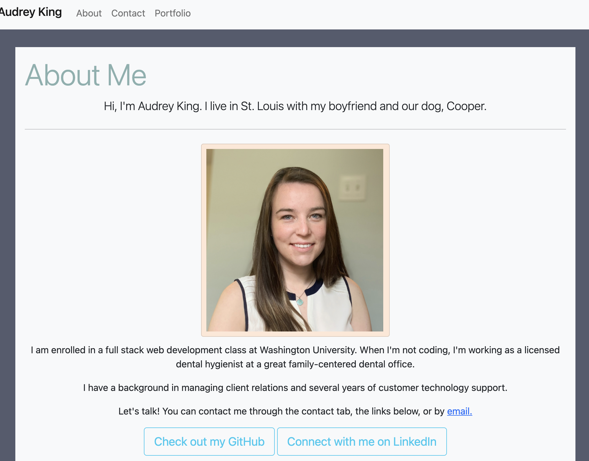
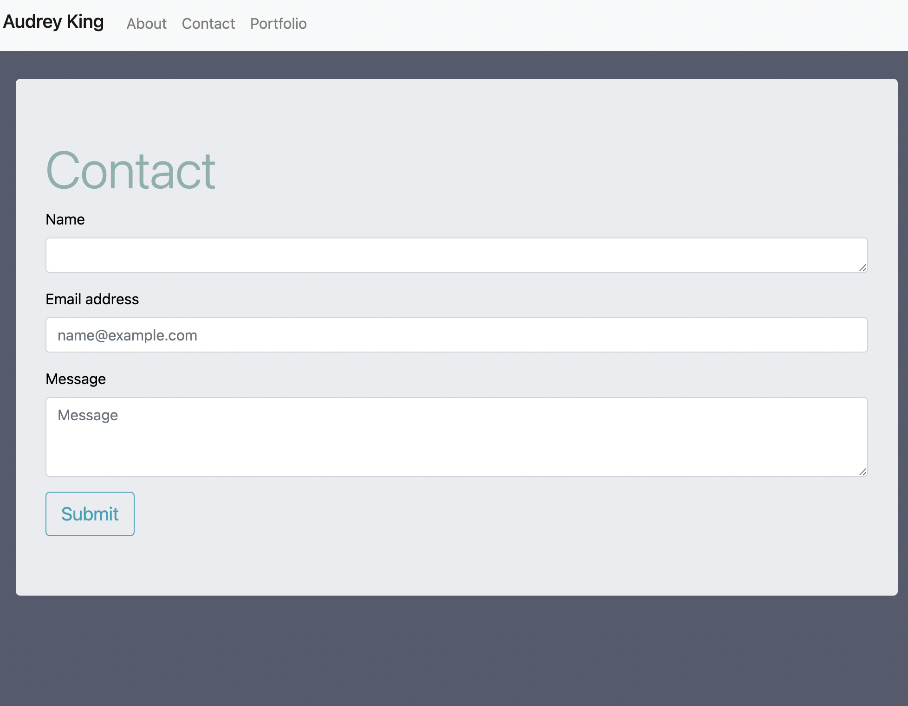
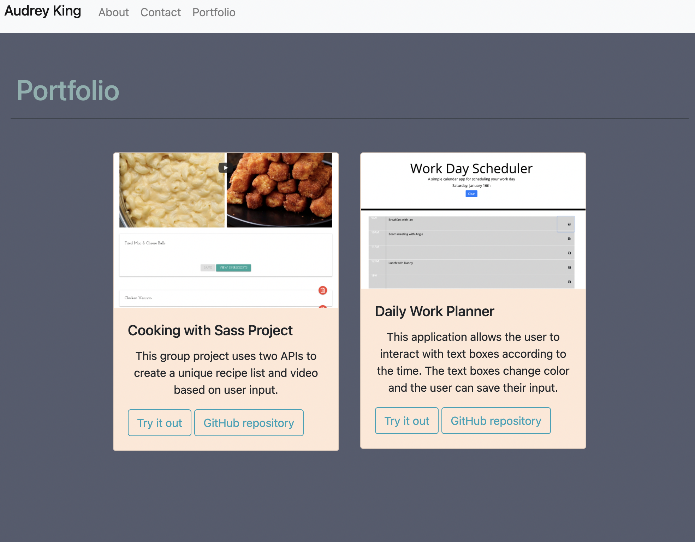

# Audrey King Portfolio

## Introduction

This application shows my current portfolio and showcases my favorite projects I completed so far in the program.
This portfolio contains: 
* A downloadable PDF of my current resume
* A contact form page
* Links to my GitHub, LinkedIn, and email.
* Links and screenshots of two recent projects

## Requirements

This application required:
* HTML
* CSS
* Bootstrap

I also used the website https://coolors.co/ to create a color palatte for the portfolio

## Mock Up and Link

Click on the link for the full portfolio
https://audreymking.github.io/Audrey-King-Portfolio/
